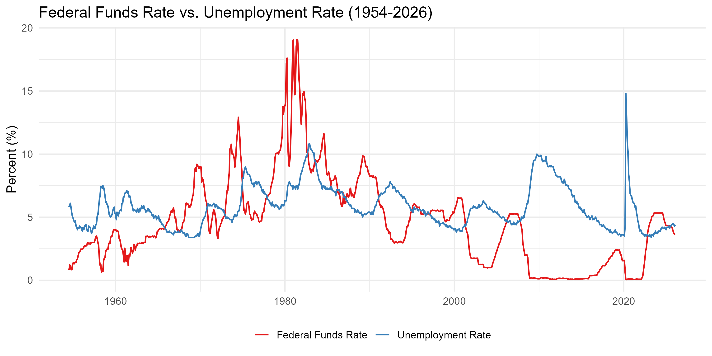
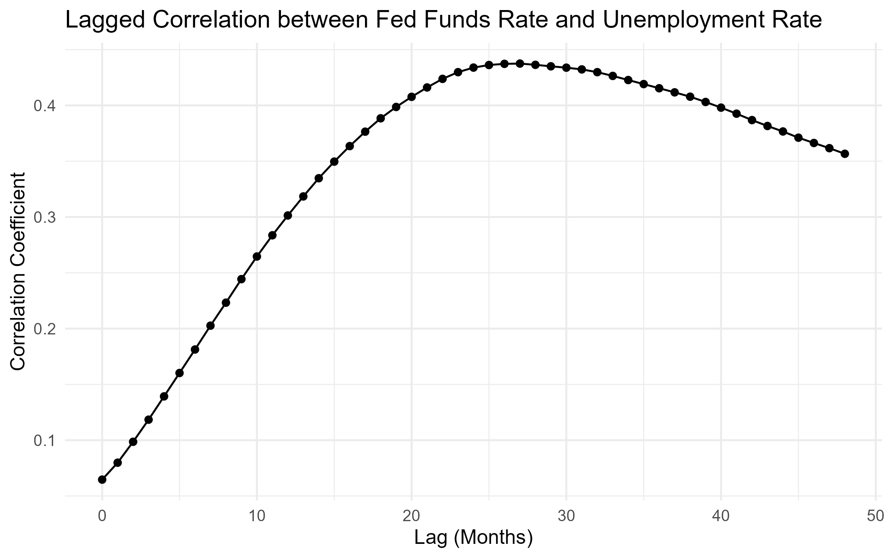
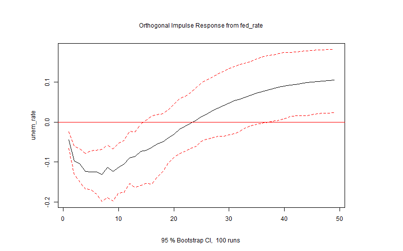

# Federal Funds Rate and Unemployment Rate: A Time Series Analysis

## Data

Monthly observations of the Federal Funds Rate (FEDFUNDS) and the U.S. Unemployment Rate (UNRATE) were obtained from the Federal Reserve Bank of St. Louis (FRED). After merging on date, the overlapping period spans **July 1954 to February 2026**, yielding **860 matched monthly observations**. One missing UNRATE value (October 2025) was filled via linear interpolation.

## Visual Overview

Plotting both series over time reveals several notable episodes. The most striking is the **Volcker era (1980–1982)**, where the Fed raised rates into the high teens to combat inflation, and unemployment followed, breaching 10%. The **COVID-19 pandemic (2020)** is an important outlier — unemployment spiked to nearly 15% due to an external shock entirely unrelated to monetary policy, while the Fed actually cut rates toward zero in response. These episodes illustrate both the expected relationship and its limits.

## Lagged Correlation

To account for the delayed transmission of monetary policy, the correlation between the fed funds rate at time *t* and unemployment at time *t + k* was computed for lags 0 through 48 months. The correlation follows an S-curve shape, starting near zero at short lags, accelerating through an inflection point around month 10, and peaking at **r = 0.438 at a lag of 27 months** before declining to 0.357 at 48 months. This suggests the fed rate has its strongest statistical association with unemployment roughly **two years later**, consistent with the known slow transmission of monetary policy through credit markets, business investment, and hiring decisions.

## Granger Causality

Lag order was selected objectively using the Akaike Information Criterion (AIC) via `VARselect`, which recommended **order 14**. Granger causality tests were then run in both directions:

- **Fed rate → Unemployment:** F(14, 817) = 2.30, **p = 0.004** — statistically significant at the 0.01 level. Past values of the fed rate contain meaningful predictive information about future unemployment beyond what unemployment's own history provides.
- **Unemployment → Fed rate:** F(14, 817) = 0.85, **p = 0.611** — not significant. Past unemployment does not meaningfully predict the fed rate in this framework, likely because the Fed responds to many signals simultaneously, particularly inflation.

## Impulse Response Function

A two-variable VAR(14) model was estimated and used to trace the response of unemployment to a one standard deviation shock in the fed rate over 48 months. The IRF shows an initial **negative response** (unemployment falling) through roughly month 25, before turning positive and reaching approximately +0.10 by month 48. The 95% bootstrapped confidence band crosses zero throughout the entire window, meaning the effect is **not statistically distinguishable from zero** at any individual horizon.

The initial negative dip likely reflects an endogeneity problem: the Fed historically raises rates during periods of economic strength when unemployment is already low, so the data conflates the Fed's reaction to conditions with the downstream effect of its actions. Isolating the true causal effect would require a structural VAR (SVAR) that explicitly models the Fed's reaction function.

## Summary

The evidence suggests a moderate, slow-moving relationship between the federal funds rate and unemployment. The Granger test confirms that the fed rate has statistically significant predictive power over future unemployment (p = 0.004) at a 14-month lag order, with the lagged correlation peaking at 27 months (r = 0.438). However, the IRF indicates the effect is diffuse and statistically uncertain at any given horizon, and the initial negative response points to endogeneity concerns that limit causal interpretation. A structural approach would be a natural next step.
